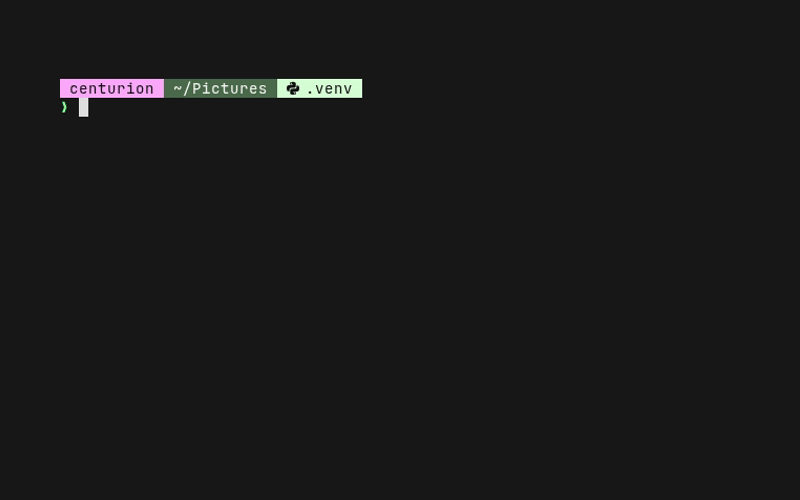

# Sorting Hat

A command-line tool that uses AI to suggest descriptive filenames based on file contents. Features an animated ASCII Hat that "thinks" while streaming the LLM's reasoning tokens, then reveals the suggested name.


```
  ┌──────────────────────────────────────────────────┐
  │ Hmm, this appears to be a sunset photograph      │
  │ taken over a mountain range...                   │
  └──┐───────────────────────────────────────────────┘
     │
     ╰─┐
       |
        /\
       /  '.
      / .-'
     | o  o |
     / ~~~~ \
  __/````````\__
    IMG_3847.jpg
```
Works with any OpenAI-compatible API: local servers (llama.cpp, Ollama, vLLM, LM Studio) or cloud providers (OpenAI, Together, etc).

### Demo  


  


## Changelog

- Guard against stem-less dotfile rename when the model returns nothing usable (#32)
- Video file support: MP4, MKV, WebM, AVI, MOV, etc. — named from `ffprobe` metadata (#30)
- `--preview` / `-p` flag prints a content snippet to stderr before the hat animation (#28)
- Fix `is_audio` false-positives for MP4 / HEIC / MOV — check ftyp major brand (#27)
- Audio file support: MP3, WAV, FLAC, OGG, AAC, M4A — named from `ffprobe` tags (#20)
- Auto-enumerate duplicate filenames in batch mode (#9)
- Isolate extension from model output for reliable results with small models (#1)
- `--context` / `-c` flag for guided naming (#2)
- File metadata (size, mtime, MIME, EXIF) in LLM context (#3), `--no-metadata` to opt out
- LLM guard clause skips already-descriptive filenames (#4), `--force` to override
- `--nothink` / `--fullthink` to control reasoning for guard clause and naming
- Animation shows original filename until rename is confirmed (#11)
- Bats test suite with mock LLM server (#10)
- Content-based binary/image detection via `file(1)` and magic bytes
- Proper error handling for LLM connection failures

## Features

- Animated Sorting Hat with drop animation, blinking eyes, and streaming thought bubble
- Supports text files, images (JPEG, PNG, GIF, BMP, TIFF, WebP, SVG), audio (MP3, WAV, FLAC, OGG, AAC, M4A, …), and video (MP4, MKV, WebM, AVI, MOV, …)
- Auto-detects image / audio / video files by magic bytes and extension
- `--preview` / `-p` to print a content snippet to stderr before the hat animation
- Handles reasoning/thinking tokens from models like Qwen, DeepSeek, etc.
- Quiet mode for scripting (`--quiet` / `-q`)
- Configurable reasoning: guard clause defaults to no thinking, naming uses thinking. `--nothink` disables both, `--fullthink` enables both
- Batch processing for entire directories (processes files sequentially)
- LLM-powered guard clause skips files that already have descriptive names using a two-turn conversation (`--force` to override)
- Additional context for guided naming (`--context` / `-c`)
- File metadata (EXIF, timestamps, MIME type) included in LLM context (`--no-metadata` to disable)
- Interactive rename with confirmation (`--yes` / `-y` to auto-rename without prompting)
- Robust extension handling: isolates name stem from extension for reliable results with smaller models

## Supported Formats

| Format | How it works |
|--------|-------------|
| **Text files** (.txt, .md, .py, .json, .csv, .xml, .html, etc.) | First 4000 characters of content sent to the LLM |
| **Images** (JPEG, PNG, SVG) | Base64-encoded and sent via the multimodal API |
| **Images** (WebP, BMP, TIFF, GIF) | Converted to PNG via Pillow, then sent as above |
| **Audio** (MP3, FLAC, OGG, AAC, WAV, M4A, Opus, WMA, AIFF, APE) | Not sent to the LLM directly — named from embedded tags (title/artist/album/genre/date + duration) read via `ffprobe` |
| **Video** (MP4, MKV, WebM, AVI, MOV, M4V, WMV, FLV, MPEG, MPG, 3GP, OGV, TS, MTS, M2TS) | Not sent to the LLM directly — named from `ffprobe` metadata (codec, duration, resolution, container tags) |

Image naming requires a vision-capable model (e.g. `llava`). Audio and video naming require `ffprobe` (from FFmpeg) for metadata extraction; images additionally include any EXIF metadata in the prompt.

## Requirements

- Bash 4+
- Python 3.6+
- An OpenAI-compatible LLM API endpoint
- For image naming: a vision-capable model (e.g., GPT-4o, LLaVA, Qwen-VL)
- Optional: `Pillow` (`pip install Pillow`) for EXIF metadata extraction from images
- Optional: `ffprobe` (from `ffmpeg`) for richer audio metadata (tags, duration, bitrate, codec)

## Installation

```bash
# Clone the repo
git clone https://github.com/marksverdhei/sorting-hat.git
cd sorting-hat

# Option 1: Symlink to your PATH
ln -s "$(pwd)/hat" ~/.local/bin/hat

# Option 2: Copy directly
cp hat ~/.local/bin/hat

# Option 3: Add the repo to PATH
echo 'export PATH="$PATH:'"$(pwd)"'"' >> ~/.bashrc
```

## Configuration

Set these environment variables (or export them in your shell profile):

| Variable | Default | Description |
|----------|---------|-------------|
| `LLM_BASE_URL` | `http://localhost:8080` | Base URL of your OpenAI-compatible API |
| `HAT_MODEL` | `Qwen3.5-9b` | Model name to use |
| `HAT_API_KEY` | *(empty)* | API key (optional, for cloud providers) |
| `HAT_REASONING_BUDGET` | `1024` | Reasoning token budget for naming (`-1` for unlimited) |

### Example configurations

**llama.cpp** (local, default port):
```bash
export LLM_BASE_URL=http://localhost:8080
export HAT_MODEL=Qwen/Qwen3.5-9b
```

**Ollama**:
```bash
export LLM_BASE_URL=http://localhost:11434
export HAT_MODEL=Qwen/Qwen3.5-9b
```

**vLLM**:
```bash
export LLM_BASE_URL=http://localhost:8000
export HAT_MODEL=Qwen/Qwen3.5-9b
```

**OpenAI**:
```bash
export LLM_BASE_URL=https://api.openai.com
export HAT_MODEL=Qwen3.5-9b
export HAT_API_KEY=sk-...
```

**Hugging Face Inference**:
```bash
export LLM_BASE_URL=https://router.huggingface.co/hf-inference
export HAT_MODEL=Qwen/Qwen3.5-9b
export HAT_API_KEY=hf_...
```

## Usage

```bash
# Suggest a name for a file (animated)
hat photo.jpg

# Suggest and prompt to rename
hat --rename IMG_20240301_143022.jpg

# Auto-rename without confirmation
hat -y IMG_20240301_143022.jpg

# Process all files in a directory
hat --batch ~/Downloads/

# Force image mode for a file
hat --image screenshot.png

# Quiet mode (no animation, for scripting)
hat --quiet document.pdf

# Dry run (show suggestion, don't ask to rename)
hat --dry-run report.txt

# Let the model choose the extension
hat --no-ext mystery-file

# Disable reasoning/thinking tokens for both guard clause and naming
hat --nothink photo.jpg

# Enable thinking for both guard clause and naming
hat --fullthink photo.jpg

# Provide context to guide naming
hat -c "quarterly finance report" document.pdf

# Process all files, even those with good names
hat --batch --force ~/Downloads/

# Skip metadata collection
hat --no-metadata photo.jpg

# Preview file content on stderr before the animation runs
hat --preview document.txt
```

### Scripting

The suggested filename is printed to stdout, while the animation goes to stderr. This means you can capture just the name:

```bash
# Capture the suggested name
new_name=$(hat --quiet photo.jpg)
echo "Suggested: $new_name"

# Rename all files in a directory
for f in ~/unsorted/*; do
  suggested=$(hat --quiet "$f")
  [ -n "$suggested" ] && mv "$f" "$(dirname "$f")/$suggested"
done
```

## How it works

1. **Guard clause**: Asks the LLM whether the current filename is already descriptive. If yes, skips the file. If no, the check conversation becomes context for the naming request (two-turn multi-turn). Use `--force` to skip the check entirely.
2. **Metadata collection**: Gathers file metadata (size, modification date, MIME type, EXIF for images) to give the LLM more context. Use `--no-metadata` to skip.
3. **File analysis**: For text files, reads the first 4KB of content. For images, base64-encodes and sends via the OpenAI multimodal format. For audio files, extracts tags, duration, bitrate, and codec via `ffprobe` (if available) and passes them as text context — no audio bytes are sent to the LLM.
4. **LLM query**: Sends the content, metadata, and any user context (`--context`) to your configured LLM with a prompt asking for a descriptive kebab-case filename. When the guard clause ran first, this becomes a multi-turn conversation with richer context.
5. **Streaming display**: Shows the model's reasoning tokens in a speech bubble above the animated hat (supports both `reasoning_content` field and `<think>` tags).
6. **Name sanitization**: Cleans the response into a valid filename. When preserving extensions (default), the model only generates the name stem and the original extension is appended automatically.

## The Animation

The Sorting Hat drops onto the filename, thinks with animated eye blinks and a streaming thought bubble, then reveals the new name with a happy face:

- **Drop phase**: Hat falls from above onto the filename
- **Thinking phase**: Eyes blink, mouth animates, thought bubble streams reasoning tokens
- **Reveal phase**: Happy face, green result in bubble and below the hat

Use `--quiet` to skip the animation entirely.

## License

MIT
